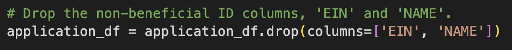
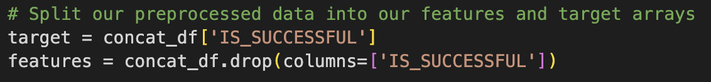
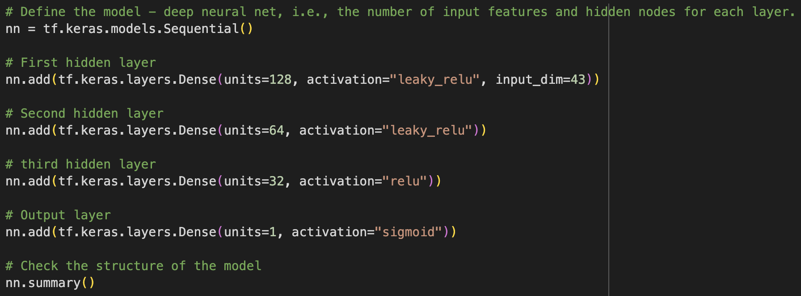
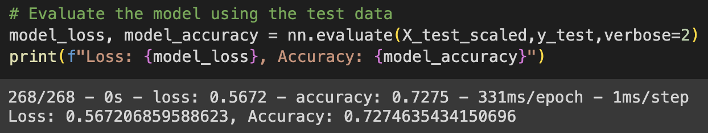

# Performance Report
- The folllowing is a report on the performance of the deep learning model I created for Alphabet Soup.
## Overview of the analysis:
- The nonprofit foundation known as Alphabet Soup wants a tool that can help it select applicants for funding with the best chance of success in their ventures. This analysis is trying to identify the targets, features, and hyperparameters that produce the most ideal model for this goal.
## Results:
- Data Preprocessing
    - What variable(s) should be removed from the input data because they are neither targets nor features?
        - I removed EIN and NAME because they were identification columns.
        
    - What variable(s) are the target(s) for your model?
        - I used the "IS_SUCCESSFUL—Was the money used effectively" as the target.
    - What variable(s) are the features for your model?
        - I used the following variables for my features:
            - APPLICATION_TYPE—Alphabet Soup application type
            - AFFILIATION—Affiliated sector of industry
            - CLASSIFICATION—Government organization classification
            - USE_CASE—Use case for funding
            - ORGANIZATION—Organization type
            - STATUS—Active status
            - INCOME_AMT—Income classification
            - SPECIAL_CONSIDERATIONS—Special considerations for application
            - ASK_AMT—Funding amount requested
        
- Compiling, Training, and Evaluating the Model
    - How many neurons, layers, and activation functions did you select for your neural network model, and why?
        - In my most successful model, I had the following neurons, layers, and activation functions:
            - Layer 1: 128 neurons and an activiation function of leaky relu
            - Layer 2: 64 neurons and an activiation function of leaky relu
            - Layer 3: 32 neurons and an activiation function of relu
            - Layer 4: 1 neurons and an activiation function of sigmoid
             
        - I chose to add a few layers and increase the amount of neurons that would improve performance. In each of my attempts, this number of layers and neurons seem to work the best. As for the activation functions, I knew that the last one needed to be sigmoid because the output needed to be between 0 and 1. As for the others, I chose them primarily through experimentation and past experience.
    - Were you able to achieve the target model performance?
        - Unfortunately, I was only able to achieve 72.7% accuracy, just short of the 75% target accuracy.
        
    - What steps did you take in your attempts to increase model performance?
        - I explored changing the number of layers, the number of neurons in each each layer, batch size, activation functions, groupings of categorical variables, and the number epochs in each of my attempts.
## Summary:
- Based on the accuracy score of my best model, I would not recommend my model and would say further exploration is needed. I was only able to achieve 72.7% accuracy compared to the desired 75% accuracy, so further exploration of different hyperparameters and combinations of existing hyperparameters is needed.